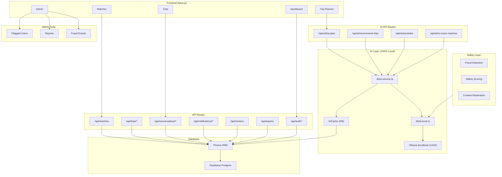

# Travel Buddy Finder – Architecture

## Mermaid Diagram

---

## Component Summary

| Component | Description |
|-----------|-------------|
| **Frontend** | Next.js 14 App Router, dashboard, matches, chat, trip planner, admin |
| **API** | Auth, trips, matches, conversations, notifications, reviews, reports |
| **AI Routes** | trip-plan, recommend-trips, assistant, re-score-matches |
| **AI Layer** | `lib/ai-local.ts` → Ollama; `lib/ai-service.ts` → cache + prompts |
| **AICache** | Prisma `AICache` table; cache keys like `trip-plan:dest:dates` |
| **Database** | Supabase Postgres, Prisma ORM |
| **Safety** | Rule-based + AI (Ollama) for profiles, messages, trips |
| **Admin** | Flagged users, reports, fraud events |
